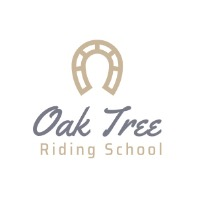
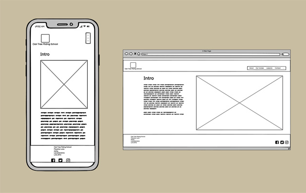
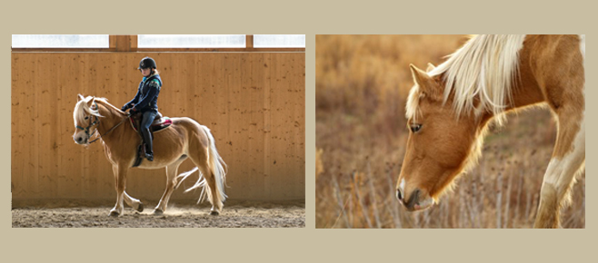
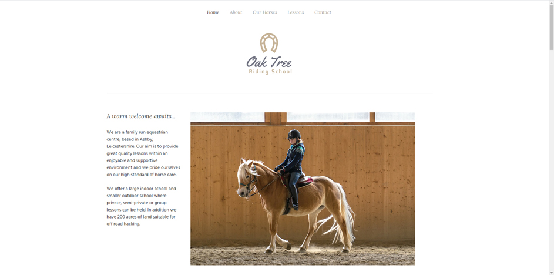
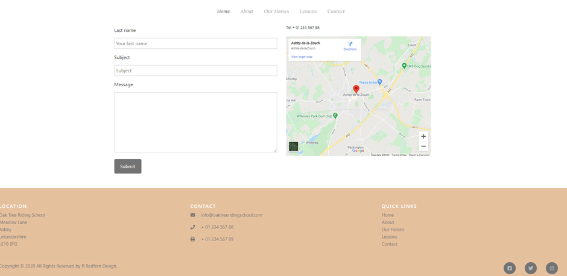
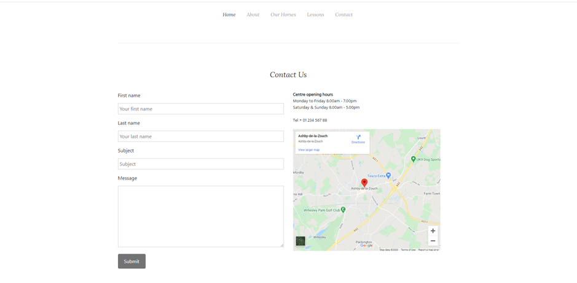
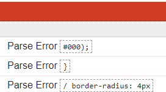
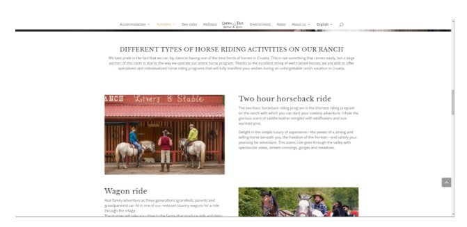
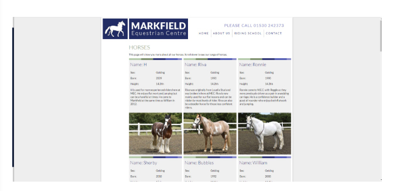

# Oak Tree Riding School

A website to promote a family run equestrian centre within Leicestershire, UK.

Please [click here](https://rebeccadev.github.io/MS1-Oak-Tree-Riding-School/) to view the website.

 
## UX
 
### Aims

**External user’s goal** 

The site's users are both aspiring and existing equestrians (or parents of) who wish to know more about the riding school, facilities and lesson options available to them.

**Site owner's goal**

To promote the riding school to potential new clients whilst increasing brand and company awareness. 

 

#### User Stories
> -  *I want to be informed of the facilities that are available at the riding school to see if they are suitable for my needs.*
> -  *I would like to see the lesson options available and pricing structures.*
> -  *I would like to be able to book a lesson or make an enquiry about the school via a contact form.*
> -  *I would like to engage with the school through social media, such as Facebook for viewing up to date information
and Instagram to view the facilities further.*

- #### First Time Visitor Goals
  - As a First Time Visitor, I want to easily understand the main purpose of the site and to learn more about the riding school.

  - As a First Time Visitor, I want to be able to easily navigate throughout the site to find content such as information on facilities and lesson pricing.

  - As a First Time Visitor, I want to look at potential social media platforms to gain more information about the riding school and to see if they are recommended.

- #### Returning Visitor Goals
  - As a Returning Visitor, I want to find information about lesson prices.

  - As a Returning Visitor, I want to find the best way to get in contact to either book a lesson or make a general enquiry.

  - As a Returning Visitor, I want to find location information to see if it would be feasible to travel to the riding school.

### Skeleton

Wireframes have been created using a mobile first approach. 
Please [click here](wireframesdesktopandmobile.pdf) to view the PDF showing full wireframes for the site. 

### Surface
I have taken on inspiration from sites such as Linden Tree Ranch and Markfield equestrian centre. I want to provide a website that is very
clean by utilizing whitespace and strong typography to make it inviting to the user and to make content easily readable. 

**Colours**

White space has been used to provide a sense of calm, I have also utilised a golden sand colour (#fafafa) within the logo and footer. 
This has been used to tie in with the sand in the arena of the riding school and also provides an upmarket feel to the site and brand. 

I have used (#ffffff) for my main text to make the typography contrasting and clear to the user against the white background. 

**Typography**

**Heading text**

The font Lora has been used for headings - this font has been selected to provide an upmarket feel to the branding.

**Body text**

 Hind Madurai has been used for the body text, this sans serif font is clearly legible to the user and contrasts nicely against the heading and navigation font of Lora.

**Photography**

Photography is one of the important elements on the site, bright and calming images have been used to create a sense of relaxation to the user and 
to tie in with the simple color palette. 

---
## Features

### Current features

- **Intro/Homepage:** contains hero image to create impact, contains initial information about the riding school.
- **Lesson details:** provide information on the types of lessons available and pricing options.
- **Our horses page:**  gallery and information page so potential clients can view and gain more information on different equines at the school. 
- **Contact form:**  contact form where users can make enquiries and book lessons. 
- **Location:**  provide map so users can view the location of the riding school and see if it is viable for them to travel there. 
- **Footer:** with social media links to enable easy access to other social media sites which can offer more information to the user.

### Features to be added

These are features that lie out of the current scope, but could be added when knowledge of development increases.

- **Calendar booking option** - so clients have the option to book their lessons via the website. 

- **Blog** - This would enable potential and existing clients to be updated on current news and events
that are happening within the riding school. 

- **Merchandise store** - so clients can buy merchandise from the riding school such as t-shirts and hoodies, this would also increase brand awareness further. 

## Technologies 

The following technologies have been used in the project.

**Languages**

- HTML 

- CSS

**Frameworks**

- [Bootstrap](https://getbootstrap.com/) -  Free and open-source CSS framework directed at responsive, mobile-first front-end web development

**Integrations**
- [Font Awesome](https://fontawesome.com/) - used for icons within the footer bar. 

- [Google fonts](https://fonts.google.com/) - A library of 1005 free licensed font families. 

**IDE, Version control, Repository storage**

[Git](https://git-scm.com/) - Distributed Version Control tool to store versions of files and track changes.

[GitPod](https://gitpod.io/) - Workspace IDE.

[GitHub](https://github.com/) - Hosting service used to manage my Git repositories.

---
## Resources

The following resources have been used within the project.

* [Fontjoy](https://fontjoy.com/) - a google font pairing generator.

* [Wix logo maker](https://www.wix.com/logo/maker) - for the logo creation. 

* [Adobe Photoshop](https://www.adobe.com/uk/products/photoshop.html) for editing image sizes and for using the color picker.

* [Anna Greaves Bootstrap essentials grid](https://ajgreaves.github.io/bootstrap-grid-demo/index.html) - this has been an excellent resource to clarify
my understanding of the Bootstrap grid. 

* [w3schools.com](https://www.w3schools.com/) - resource to improve general knowledge of HTML and CSS

* [Balsamiq](https://balsamiq.com/) - used for the creation of wireframes during UI design stage. 

* [Chrome DevTools](https://developers.google.com/web/tools/chrome-devtools) - used to debug HTML and CSS and to view responsiveness on different screen sizes.

* [Responsinator](http://www.responsinator.com/) - used to test responsiveness of the website at different resolutions.

## Testing

#### Testing user Stories

**First Time Visitor Goals**

- As a First Time Visitor, I want to easily understand the main purpose of the site and learn more about the organisation.

  - When opening the site the user is greeted by a large logo in the center. The homepage is clear with a large image of the indoor school and introduction alongside to create a great first impression.

- As a First Time Visitor, I want to be able to easily navigate throughout the site to find content such as information on facilities and lesson pricing.

  - The navbar is clear using a color palette of black text on white, it remains fixed so users can easily access any links on the website.

- As a First Time Visitor, I want to look at potential social media platforms to gain more information about the riding school and to see if they are recommended.
  - The footer contains links to the social media websites where they can learn more about the riding school,
  how popular it is, and any reviews from current clients. 

**Returning Visitor Goals**

- As a Returning Visitor, I want to find information about lesson prices.

  - This section is clearly located lesson section within the navbar. There is also an additional link in the footer 
 which takes the user to the lesson section. 

 

-    As a Returning Visitor, I want to find the best way to get in contact to either book a lesson or make a general enquiry.
   

     - There is a clearly located section contact within the navbar. In addition there is a contact section within the footer bar.
   Links to social media have been included in the footerbar if the visitor would like to contact the school via this method.

-   As a Returning Visitor, I want to find location information to see if it would be feasible to travel to the riding school.

    - Within the contact section there is a map where users can see the location of the riding school. The address has also been
    included clearly within the footer. 

- The W3C Markup Validator and W3C CSS Validator Services were used to validate the website and ensure that there were
no syntax errors.

- [Chrome DevTools](https://developers.google.com/web/tools/chrome-devtools)  has been used to test the responsiveness of the website

- [Responsinator](http://www.responsinator.com/) - has also been used to test responsiveness of the website at different resolutions.

## Problems and solutions 

### Design

1. In my wireframes I had opted to have the logo to the top left of the page. I felt 
that this resulted in it getting lost within the whitespace. I decided to make the design
decision to center this. I felt it created more of an impact on both desktop and mobile
views.

### Navigation bar

1. The Navbar menu background was going transparent when toggling on mobile view. This was fixed by using Chrome dev tools to select the class and override the Bootstrap styling.

2. When using the fixed navbar the main Logo was covered this was fixed by adding margin top in the CSS.

### Page aesthetics
1. Headers of the site were masked by the navigation bar when clicking different links of the site - margin top was 
added to each section to ensure that headers could be viewed and weren't masked by the header bar.

2. On mobile view the instructors section images weren't centered correctly. This was fixed by adding divs around the images with a text-center property.
Left and right padding was also added to the text within the instructors section to improve the page aesthetics in mobile view.

3. Overflow - when testing the website on mobile devices there was unwanted horizontal overflow. Chrome DevTools was used to determine which element
was causing the overflow. This was found to be within the instructors section. This error was found to be caused within the row inline styling was used to
correct it. Testing was then carried out using Chrome DevTools and Responsinator as well as testing on a Google Pixel 3a mobile device. Further testing ensured
that the overflow problem has been solved. 

### Functionality
1. The social media links were displaying a 404. This was fixed by updating the link and including https:// in the link address. 

2. The contact form was missing the required element - this was added so the form couldn't be
submitted without entries. 

3. The social media icons were missing span elements - this would be added
to enable functionality for users that require screen readers. 

### CSS validation
1. When using the (Jigsaw)[https://jigsaw.w3.org/] CSS validator the following errors arose.

These were debugged and then the code was tested again using direct input where it was free of errors.

---
## Deployment 
The website was deployed to Github pages via the following steps.
1. Log in to Github and locate the websites repository.
2. Under the repository name click on settings on the top right of the menu.
3. Under the source section select the dropdown 'None' and Master branch.
4. The page will automatically refresh.
5. Scroll back down through the page to locate the now published site link in the "GitHub Pages" section.

## Credits

Inspiration has been taken from the following websites

- [Linden Tree Retreat and Ranch](https://www.lindenretreat.com/)

I really like the use of whitespace and focus on strong imagery
and typography. I felt like this was something I wanted to utilize within my own project. 

- [Markfield Equestrian Centre](https://www.mecweb.co.uk/) 

I feel like this riding school website has a good structure for prospective clients to gain information on the riding school with ease. I wanted to emulate this 
within my project. I was particuarly inspired by the layout of the horses section and this has led me to the use bootstrap cards within this section to provide clear concise information
on horses at the riding school.

**Photography**
* [Unsplash](https://unsplash.com/) and [Pixabay](https://pixabay.com/) - royalty free stock images for
photography used within the website.

**Copy**

All copy has been written by the developer. 

**Code Snippets**

- The [Bootstrap](https://getbootstrap.com/) Library was used in order to make the site responsive using the grid system. 

- [Footer Template](https://codepen.io/scanfcode/pen/MEZPNd) which was used for inspiration and edited to fit into the design of my site 

## Acknowledgements

- My mentor Antonio Rodriguez for their helpful feedback. 

- [Jim Lynx](https://github.com/JimLynx) - current channel lead for the user centric frontend module, the presentations in both
MS1 planning and GitHub and Gitpod have been a valuable learning resource. 

- The Code institute slack community - including help for specific link and navigation styling queries from [Anthony](https://github.com/auxfuse) and [Jim Lynx](https://github.com/JimLynx).

- Tutor support for help with a couple of technical queries. 

